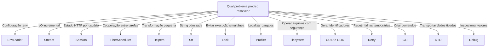

<div align="center">

# Omegaalfa Utils

**Utilitários PHP pequenos, tipados e sem dependências de runtime.**

[](https://www.php.net/)
[](https://github.com/omegaalfa/Utils/actions/workflows/ci.yaml)
[](LICENSE)
[](composer.json)

Um ecossistema modular para scripts, aplicações CLI e microsserviços.

</div>

## Visão geral

O Omegaalfa Utils reúne componentes independentes para problemas recorrentes de infraestrutura PHP. O projeto prioriza APIs pequenas, comportamento explícito e baixo custo de adoção.

Cada módulo possui responsabilidade e documentação próprias. Você pode usar somente as APIs necessárias; nenhum framework, container ou ciclo de vida global é imposto pelo pacote.

## Instalação

Todos os módulos são distribuídos atualmente pelo mesmo pacote Composer:

```bash
composer require omegaalfa/utils
```

Requisitos:

| Requisito | Versão |
|---|---|
| PHP | 8.4 ou superior |
| Extensões obrigatórias adicionais | intl e mbstring |
| Dependências de runtime | Nenhuma |
| Autoload | PSR-4; helpers globais são opt-in |

## Módulos

| Módulo | Responsabilidade | Use quando | Documentação |
|---|---|---|---|
| EnvLoader | Ler configuração de arquivos `.env` confiáveis | Scripts, CLIs e desenvolvimento local precisam carregar variáveis | [Guia do EnvLoader](src/EnvLoader/README.md) |
| Stream | Encapsular resources nativos com leitura incremental | Você precisa manipular arquivos, memória, linhas ou CSV sem carregar tudo | [Guia de Stream](src/Stream/README.md) |
| Session | Gerenciar a sessão nativa preservando tipos | Uma aplicação HTTP pequena precisa de uma API previsível sobre `$_SESSION` | [Guia de Session](src/Session/README.md) |
| Fibers | Agendar tarefas cooperativas em round-robin | Tarefas em uma thread precisam ceder controle explicitamente | [Guia de Fibers](src/Fibers/README.md) |
| Helpers | Funções opcionais de texto, JSON e validação | Um script aceita importar explicitamente funções globais | [Guia de Helpers](helpers/README.md) |
| Debug | Dump tipado com atalhos globais opcionais | Você precisa inspecionar valores durante o desenvolvimento | [Guia de Debug](src/Debug/README.md) |
| String Utils | Operações estáticas otimizadas de string | Você precisa de consultas, slug, truncamento, random ou máscara | [Guia de String Utils](src/Str/README.md) |
| Lock | Exclusão mútua entre processos locais | Uma operação não pode executar simultaneamente | [Guia de Lock](src/Lock/README.md) |
| Profiler | Tempo, memória, chamadas e etapas | Você precisa localizar gargalos com dados reais | [Guia de Profiler](src/Profiler/README.md) |
| Filesystem | Arquivos e diretórios com raiz isolada e operações previsíveis | Você precisa controlar caminhos, escrita, cópia, movimentação ou streams | [Guia de Filesystem](src/Filesystem/README.md) |
| UUID e ULID | Identificadores únicos e ordenáveis por tempo | Você precisa gerar IDs sem depender do banco de dados | [Guia de UUID e ULID](src/Identifier/README.md) |
| Retry | Repetição controlada de operações temporariamente instáveis | APIs, bancos ou filas podem falhar de forma transitória | [Guia de Retry](src/Retry/README.md) |
| CLI | Comandos, argumentos, opções e saída de terminal | Você precisa estruturar ferramentas de linha de comando pequenas | [Guia de CLI](src/Cli/README.md) |
| DTO | Objetos imutáveis e tipados para transporte de dados | Arrays sem contrato precisam virar dados previsíveis entre camadas | [Guia de DTO](src/Dto/README.md) |

## Escolha rápida



> [!IMPORTANT]
> Os módulos permanecem no mesmo pacote Composer; instale omegaalfa/utils e importe somente as APIs desejadas.

Os requisitos de ambiente são compartilhados enquanto os módulos estiverem no mesmo pacote. Helpers globais não são registrados automaticamente.

## Princípios do ecossistema

- zero dependências em produção;
- tipos estritos e PHP moderno;
- namespaces PSR-4 sob `Omegaalfa\Utils`;
- falhas explícitas por exceptions;
- processamento incremental quando aplicável;
- ausência de integração obrigatória com frameworks;
- testes automatizados e PHPStan no nível máximo.

## Desenvolvimento

```bash
composer install
composer check
composer test:coverage
composer audit
```

`composer check` executa análise estática e testes. Mudanças de comportamento devem incluir testes e atualização do README do módulo afetado.

## Contribuição

Antes de propor um novo módulo, confirme que ele:

1. resolve uma responsabilidade pequena e bem definida;
2. não duplica uma solução nativa simples sem ganho claro;
3. não introduz dependência de runtime sem justificativa;
4. possui contratos tipados, testes e documentação independente;
5. não mistura responsabilidades de outro módulo.

Abra uma issue para discutir alterações amplas. Pull requests devem passar por `composer check` e `composer audit`.

## Licença

Distribuído sob a [licença MIT](LICENSE).
