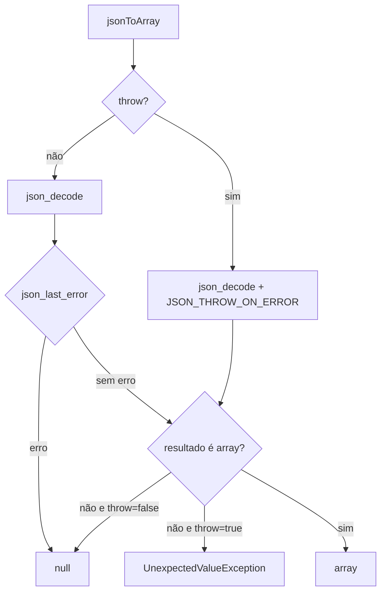

# Helpers

> Funções globais pequenas para texto, validação, JSON, tempo e depuração.

[← Portal do ecossistema](../README.md)

## Introdução

Os helpers oferecem operações diretas para scripts que não justificam objetos dedicados. Eles são carregados automaticamente pelo Composer e protegidos por `function_exists()`.

Use-os quando nomes globais e contratos pequenos forem aceitáveis. Não os use como camada de validação de domínio, segurança SQL, serializador configurável, biblioteca Unicode completa ou substituto de componentes especializados.

## Principais recursos

- ✅ carregamento automático;
- ✅ proteção contra redeclaração;
- ✅ tipos estritos;
- ✅ normalização de texto sem extensão adicional;
- ✅ validação sem alteração silenciosa;
- ✅ JSON em uma única passagem para decode;
- ✅ timestamp com timezone sem alterar configuração global;
- ❌ funções globais não são isoladas por namespace;
- ❌ transliteração não cobre todos os alfabetos Unicode;
- ❌ validação SQL não processa consultas.

## Instalação

```bash
composer require omegaalfa/utils
```

Após carregar `vendor/autoload.php`, todas as funções ficam disponíveis. Requer PHP 8.4+ e nenhuma extensão adicional.

## Início rápido

```php
<?php

declare(strict_types=1);

require __DIR__ . '/vendor/autoload.php';

$slug = slugify('Olá, São Paulo!');
$email = filter_validate_email('developer@example.com');
$json = arrayToJson(['slug' => $slug, 'email' => $email]);

echo $json;
```

Resultado:

```json
{"slug":"ola-sao-paulo","email":"developer@example.com"}
```

## Conceitos

### Funções globais protegidas

Cada declaração usa `function_exists()`. Se a aplicação declarar uma função de mesmo nome antes do autoload, a implementação da aplicação prevalece. Isso evita fatal error, mas significa que o comportamento pode variar conforme a ordem de carregamento.

### Validar não é sanitizar

Os helpers `filter_validate_*` retornam o valor tipado quando válido e `null` quando inválido. Eles não removem partes da entrada para produzir outro valor.

### JSON e passagem única

`jsonToArray()` decodifica diretamente. No modo padrão, usa `json_last_error()` sem exceptions; com `throw: true`, usa `JSON_THROW_ON_ERROR`. Executar `json_validate()` antes duplicaria o parsing quando o conteúdo precisa ser materializado.

## Casos de uso

### Texto para URL

```php
$title = '  Introdução ao PHP 8.4 — Guia rápido  ';

$slug = slugify(normalizarEspacos($title));
// introducao-ao-php-8-4-guia-rapido
```

### Validação de entrada

```php
$port = filter_validate_int($_GET['port'] ?? '');
$price = filter_validate_float($_POST['price'] ?? '');
$email = filter_validate_email($_POST['email'] ?? '');

if ($port === null || $email === null) {
    http_response_code(422);
}
```

### Identificador SQL allow-listed

```php
$requestedColumn = filter_validate_sql($_GET['sort'] ?? '');

$allowed = ['name', 'created_at'];
if ($requestedColumn === null || !in_array($requestedColumn, $allowed, true)) {
    $requestedColumn = 'created_at';
}

$sql = "SELECT id, name FROM users ORDER BY {$requestedColumn}";
```

> [!WARNING]
> Isso vale apenas para identificadores allow-listed. Valores pertencem a prepared statements.

### JSON com tratamento simples

```php
$payload = jsonToArray($requestBody);

if ($payload === null) {
    http_response_code(400);
    echo 'Expected a JSON object or array.';
}
```

### JSON com exceptions

```php
try {
    $payload = jsonToArray($requestBody, throw: true);
} catch (JsonException | UnexpectedValueException $exception) {
    // JSON inválido ou raiz escalar.
}
```

### Horário sem estado global

```php
$createdAt = timestamp();      // America/Sao_Paulo
$utc = timestamp('UTC');

// date_default_timezone_get() não é modificado.
```

### Depuração

```php
dd($payload, $createdAt);
```

Em CLI usa `var_dump()` diretamente. Em ambiente não CLI, envolve a saída com `<pre>`. Sempre encerra com status 1.

## Guia completo da API

### Texto

| Função | Retorno | Contrato |
|---|---|---|
| `slugify(string $string)` | `string` | Translitera caracteres latinos conhecidos, substitui grupos não alfanuméricos por hífen e converte ASCII para minúsculas. |
| `removerAcentos(string $string)` | `string` | Translitera o mapa latino interno e remove tudo que não seja letra ASCII, número ou espaço comum. |
| `normalizarEspacos(string $string)` | `string` | Aplica trim e reduz whitespace Unicode consecutivo a um espaço. Em UTF-8 inválido, preserva o conteúdo interno e aplica trim. |

### Validação

| Função | Retorno | Contrato |
|---|---|---|
| `filter_validate_int(int|string $value)` | `?int` | Inteiro válido ou `null`; não aceita `42px`. |
| `filter_validate_float(int|float|string $value)` | `?float` | Float reconhecido pelo filtro nativo ou `null`. |
| `filter_validate_email(string $email)` | `?string` | Remove espaços externos e valida; não corrige endereço inválido. |
| `filter_validate_sql(string $identifier)` | `?string` | Aceita somente `[A-Za-z_][A-Za-z0-9_]*`; não aceita ponto, quoting ou SQL completo. |

### JSON, tempo e debug

| Função | Retorno | Exceptions |
|---|---|---|
| `arrayToJson(array $array, bool $throw = false)` | `?string` | Com `throw: true`, propaga `JsonException`; caso contrário retorna `null`. |
| `jsonToArray(string $json, bool $throw = false)` | `?array` | Exige objeto ou array na raiz. Pode lançar `JsonException` ou `UnexpectedValueException`. |
| `timestamp(string $timezone = 'America/Sao_Paulo')` | `string` | Formato `Y-m-d H:i:s`; timezone inválido gera exception nativa de `DateTimeZone`. |
| `dd(mixed ...$values)` | `never` | Exibe valores e executa `exit(1)`. |

## Fluxo interno de JSON



## Problemas que resolve

Sem os helpers, scripts repetem regex, filtros e tratamento de erro JSON. Com eles, há contratos uniformes e retornos tipados para operações pequenas.

## Comparações

- **Funções nativas:** continuam preferíveis quando já expressam exatamente o contrato.
- **Symfony String/UID/Validator e similares:** cobrem Unicode e validação avançada, com dependências e escopo maiores.
- **Helpers:** adequados para regras deliberadamente restritas e zero dependências.

## Performance

Não há benchmark publicado. `jsonToArray()` usa uma passagem e evita exceptions no caminho padrão inválido. Regex e transliteração percorrem a entrada linearmente; a tabela de transliteração é uma constante da classe interna. `dd()` não deve existir em hot paths ou produção.

## Melhores práticas

- compare retornos validadores com `null`, não com falsy;
- aplique allow-list depois de validar identificador SQL;
- use prepared statements para valores;
- use `jsonToArray(..., throw: true)` quando exceptions fizerem parte do fluxo;
- escape texto no contexto de saída;
- não use `dd()` em código publicado;
- prefira classes namespaced se a aplicação não aceitar funções globais.

## FAQ

**Por que `jsonToArray('null')` retorna null?** Porque a função exige array ou objeto na raiz.

**`removerAcentos()` preserva pontuação?** Não.

**`filter_validate_sql()` impede SQL injection?** Não; ele só valida um identificador simples.

**Os helpers podem colidir com um framework?** A declaração não colide, mas a primeira função carregada prevalece.

## Troubleshooting

| Sintoma | Causa | Solução |
|---|---|---|
| Helper possui comportamento inesperado | Função homônima já existia | Verifique `ReflectionFunction` e ordem do autoload. |
| `jsonToArray()` retorna null para string JSON | Raiz escalar | Use `json_decode()` se escalares forem válidos no domínio. |
| Email internacional retorna null | Limites do `FILTER_VALIDATE_EMAIL` | Use validador especializado conforme requisito. |
| Caracteres desaparecem no slug | Fora do mapa latino | Adote componente Unicode especializado. |
| Processo termina em teste | `dd()` foi executado | Remova o debug ou teste em subprocesso. |

## Oportunidades de melhoria

- Nomes totalmente em inglês e consistentes melhorariam DX em projetos internacionais, mas exigiriam estratégia de compatibilidade.
- Funções namespaced reduziriam colisões globais.
- Um helper `isJson()` só agregaria valor se documentasse claramente o uso isolado de `json_validate()`.
- Transliteração Unicode completa exigiria `intl` ou dependência, contrariando o perfil atual.
- Benchmarks de JSON e slug poderiam validar ganhos em cargas reais.

## Contribuição

Execute `composer check`. Helpers novos precisam justificar por que uma função nativa não basta e incluir casos de borda.

## Licença

[MIT](../LICENSE)
