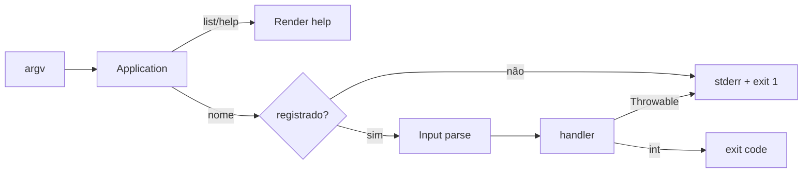

# CLI

> Núcleo pequeno para comandos, argumentos, opções e saída de terminal.

[← Portal](../../README.md)

## Introdução

CLI organiza comandos sem framework: registro por callable, parsing, ajuda, cores, perguntas, tabelas e boundary de errors.

Use em ferramentas internas e micro-aplicações. Não use quando precisa de subcommands complexos, definitions tipadas, autocomplete, progress bars sofisticadas ou ecossistema Symfony Console.

## Recursos

- ✅ registro fluente;
- ✅ argumentos posicionais;
- ✅ opções longas e flags curtas combinadas;
- ✅ marcador `--`;
- ✅ help/list;
- ✅ cores com detecção de TTY;
- ✅ perguntas;
- ✅ tabelas UTF-8;
- ✅ exit codes e tratamento de exceptions;
- ✅ streams injetáveis para testes;
- ❌ sem autocomplete;
- ❌ sem barra de progresso;
- ❌ sem schema de argumentos.

## Início rápido

Arquivo `console`:

```php
#!/usr/bin/env php
<?php

declare(strict_types=1);

require __DIR__ . '/vendor/autoload.php';

use Omegaalfa\Utils\Cli\Application;
use Omegaalfa\Utils\Cli\Input;
use Omegaalfa\Utils\Cli\Output;

$app = new Application('My Console', '1.0.0');

$app->command(
    'user:create',
    'Create a user',
    static function (Input $input, Output $output): int {
        $email = $input->argument(0);
        $output->success("Created {$email}");

        return 0;
    },
);

exit($app->run());
```

```bash
php console user:create wesley@example.com --role=admin
php console list
```

## Parsing

```text
command first --role=admin --force -vq -n=42 -- --literal
```

- argumentos: `first`, `--literal`;
- options: role=admin, force=true, v=true, q=true, n=42;
- depois de `--`, tudo é argumento.

Valores separados por espaço não são associados automaticamente: use `--name=value`.

## Casos de uso

### Opções

```php
$app->command('cache:clear', 'Clear cache', static function (
    Input $input,
    Output $output,
): int {
    $force = $input->hasOption('force');
    $scope = $input->option('scope', 'all');

    $output->writeln("scope={$scope}; force=" . ($force ? 'yes' : 'no'));
    return 0;
});
```

### Pergunta

```php
$name = $output->ask('Name', 'anonymous');
```

### Tabela

```php
$output->table(
    ['ID', 'Email', 'Active'],
    [
        [1, 'ada@example.com', true],
        [2, 'wesley@example.com', false],
    ],
);
```

### Erros

Exceptions que escapam do handler são impressas em stderr e viram exit code 1. O comando deve retornar 0 para sucesso e código não zero para falha conhecida.

## API

### Application

| Método | Descrição |
|---|---|
| `__construct(string $name='Console', string $version='1.0.0')` | Metadados do help. |
| `command(string $name, string $description, callable $handler)` | Registra `callable(Input,Output): int`; nomes duplicados/inválidos falham. |
| `run(?array $argv=null, ?Output $output=null)` | Executa e retorna exit code. |

### Input

`argument()`, `arguments()`, `option()`, `hasOption()` e `options()` fornecem o parse imutável dos tokens.

### Output

| Método | Função |
|---|---|
| `write()` / `writeln()` | stdout |
| `error()` | stderr vermelho quando suportado |
| `success()` | stdout verde |
| `style(string,string)` | black, red, green, yellow, blue, magenta, cyan, white |
| `ask(string, ?string)` | pergunta e default |
| `table(array $headers, array $rows)` | tabela alinhada com `mb_strwidth()` |

## Fluxo



## Performance e comparação

Não há benchmark. O parse é linear nos tokens. Tabelas calculam largura sobre células e comandos ficam em mapa por nome. Não há reflection, attributes ou container.

Symfony Console oferece definitions, eventos, completion e progress com escopo maior. Este núcleo favorece ferramentas pequenas.

## Boas práticas

- retorne exit codes consistentes;
- escreva dados em stdout e errors em stderr;
- mantenha handler fino;
- valide argumentos no comando;
- não dependa de cor em pipelines;
- use `--` para argumentos iniciados em hífen;
- não exponha stack trace por padrão.

## FAQ e troubleshooting

**`--name value` funciona?** Value vira argumento; use `--name=value`.

**Cores aparecem em pipe?** Por padrão, somente TTY.

**Há autocomplete/progresso?** Não.

| Sintoma | Solução |
|---|---|
| Command not found | Confira nome e registro. |
| Opção curta virou várias flags | Use `-n=value`. |
| Linha da tabela inválida | Iguale colunas ao header. |
| Saída sem cor | Force `colors: true` apenas quando apropriado. |

## Oportunidades de melhoria

Definitions tipadas, progress bar e completion merecem contratos próprios. Sinais POSIX seriam opcionais e dependentes de extensão. Middleware de comando pode ser útil, mas aumentaria bastante a arquitetura.

## Contribuição e licença

Execute `composer check`; teste streams sem terminal real. Licença [MIT](../../LICENSE).
