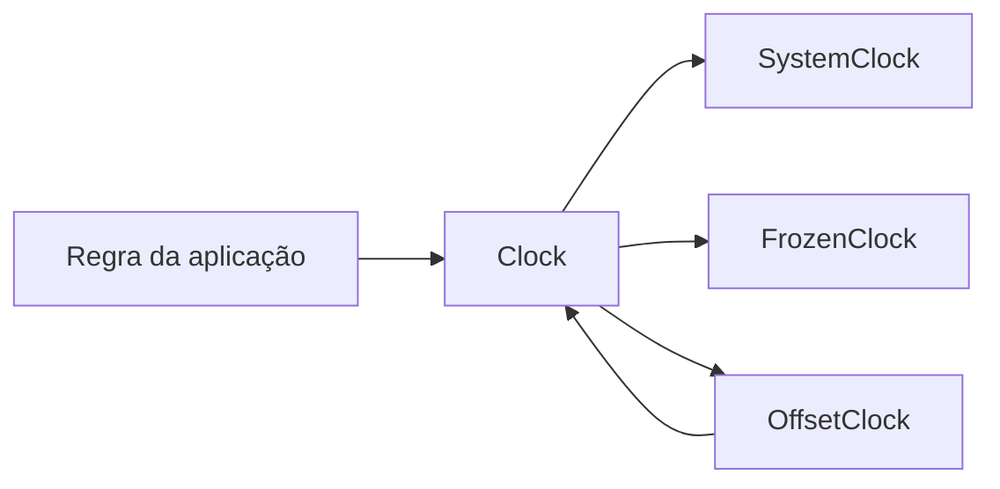

# Clock

> Abstração mínima e testável para obter o instante atual.

[← Portal](../../README.md)

## Introdução

Clock remove a leitura direta do relógio do sistema das regras da aplicação. O contrato público possui uma única operação:

```php
public function now(): DateTimeImmutable;
```

O módulo oferece o relógio real do sistema, um instante congelado para testes e um decorador que aplica deslocamentos. Não adiciona parsing, formatação ou regras de calendário.

## Motivação

Código que espalha `new DateTimeImmutable()` ou `time()` embute uma dependência invisível do ambiente:

```php
final class TokenService
{
    public function expired(DateTimeImmutable $expiresAt): bool
    {
        return $expiresAt <= new DateTimeImmutable();
    }
}
```

Com Clock, o tempo passa a ser uma dependência explícita:

```php
use Omegaalfa\Utils\Clock\Clock;

final readonly class TokenService
{
    public function __construct(private Clock $clock)
    {
    }

    public function expired(DateTimeImmutable $expiresAt): bool
    {
        return $expiresAt <= $this->clock->now();
    }
}
```

Em produção injete `SystemClock`. Em testes injete `FrozenClock` e elimine esperas, mocks de funções nativas e asserções dependentes do relógio da máquina.

## Recursos

- ✅ contrato único `Clock::now()`;
- ✅ retorno sempre `DateTimeImmutable`;
- ✅ relógio real sem estado;
- ✅ relógio congelado determinístico;
- ✅ offsets positivos, negativos e zero;
- ✅ composição de relógios;
- ✅ cópia defensiva de `DateInterval`;
- ✅ zero estado global e dependências;
- ❌ sem timers, cron ou scheduler;
- ❌ sem sleep, delay ou eventos;
- ❌ sem medição monotônica;
- ❌ sem biblioteca de datas.

## Instalação

```bash
composer require omegaalfa/utils
```

Requer PHP 8.4+. O módulo utiliza somente `DateTimeImmutable` e `DateInterval` nativos.

## SystemClock

`SystemClock` lê o relógio de parede do sistema em cada chamada e não possui estado interno:

```php
use Omegaalfa\Utils\Clock\SystemClock;

$clock = new SystemClock();
$now = $clock->now();
```

Use como implementação padrão em produção.

## FrozenClock

`FrozenClock` sempre retorna exatamente a instância recebida:

```php
use Omegaalfa\Utils\Clock\FrozenClock;

$instant = new DateTimeImmutable('2026-08-01 10:00:00 UTC');
$clock = new FrozenClock($instant);

$clock->now() === $instant; // true
$clock->now() === $clock->now(); // true
```

Isso torna testes determinísticos:

```php
$clock = new FrozenClock(
    new DateTimeImmutable('2026-08-01 10:00:00 UTC'),
);

$service = new TokenService($clock);

self::assertTrue(
    $service->expired(new DateTimeImmutable('2026-08-01 09:59:59 UTC')),
);
```

## OffsetClock

`OffsetClock` decora outro relógio e aplica um `DateInterval`:

```php
use Omegaalfa\Utils\Clock\OffsetClock;
use Omegaalfa\Utils\Clock\SystemClock;

$clock = new OffsetClock(
    new SystemClock(),
    new DateInterval('PT2H'),
);

$twoHoursAhead = $clock->now();
```

O intervalo é copiado no construtor. Alterar o objeto original depois não modifica o relógio.

### Offset negativo

`DateInterval` representa o sinal por `invert`:

```php
$offset = new DateInterval('PT30M');
$offset->invert = 1;

$clock = new OffsetClock(
    new FrozenClock(new DateTimeImmutable('2026-08-01 10:00:00 UTC')),
    $offset,
);

echo $clock->now()->format('H:i'); // 09:30
```

### Composição

Decoradores podem ser compostos sem estado global:

```php
$base = new FrozenClock(
    new DateTimeImmutable('2026-08-01 10:00:00 UTC'),
);

$plusTwoHours = new OffsetClock($base, new DateInterval('PT2H'));
$plusTwoHoursAndThirtyMinutes = new OffsetClock(
    $plusTwoHours,
    new DateInterval('PT30M'),
);
```

## API

| Tipo | API pública | Contrato |
|---|---|---|
| `Clock` | `now(): DateTimeImmutable` | Única abstração obrigatória. |
| `SystemClock` | `now(): DateTimeImmutable` | Novo instante do relógio de parede. |
| `FrozenClock` | `__construct(DateTimeImmutable $instant)` | Preserva a instância imutável. |
| `FrozenClock` | `now(): DateTimeImmutable` | Retorna sempre a mesma instância. |
| `OffsetClock` | `__construct(Clock $clock, DateInterval $offset)` | Copia o intervalo defensivamente. |
| `OffsetClock` | `now(): DateTimeImmutable` | Retorna `clock->now()->add($offset)`. |

Tipos inválidos são rejeitados pelo sistema de tipos do PHP. Intervalos inválidos são rejeitados pelo próprio `DateInterval` na criação. Não há configuração implícita ou fallback silencioso.

## Casos de uso

### Retry

Clock pode representar deadline absoluto e tornar a decisão testável. Ele não executa o delay; o módulo Retry continua responsável pela repetição síncrona.

### Cache e expiração

Compare `expiresAt` com `$clock->now()` sem depender do instante real durante testes.

### Tokens e sessões

Calcule emissão e expiração a partir do relógio injetado. Clock não implementa segurança, persistência ou renovação.

### Benchmarks

Clock pode registrar quando um benchmark começou ou terminou no calendário. Para medir duração e performance, use relógio monotônico, `hrtime()` ou o módulo Profiler.

### Testes unitários

`FrozenClock` elimina `sleep()`, tolerâncias artificiais e testes instáveis. `OffsetClock` permite simular futuro ou passado sem modificar timezone ou relógio do processo.

## Fluxo



## Timezone

Clock não gerencia timezone. Cada `DateTimeImmutable` preserva o timezone fornecido pela origem:

- `SystemClock` segue a configuração padrão do PHP;
- `FrozenClock` preserva o timezone da instância recebida;
- `OffsetClock` preserva o timezone do relógio interno.

Configure timezone no bootstrap da aplicação ou construa o instante congelado explicitamente. Não existe timezone global interno no módulo.

## Limitações deliberadas

Clock representa tempo de parede e pode sofrer ajustes do sistema operacional, NTP ou administrador. Por isso, ele não mede tempo decorrido com garantias monotônicas.

Este módulo não substitui:

- Stopwatch;
- Duration;
- Scheduler;
- Profiler;
- timers ou event loops;
- abstração de sleep;
- gerenciamento de timezone.

Essas responsabilidades exigem contratos próprios e devem permanecer em módulos separados.

## Performance

`SystemClock::now()` faz apenas uma construção nativa de `DateTimeImmutable`. `FrozenClock::now()` retorna uma referência à mesma instância. `OffsetClock::now()` delega uma chamada e usa `DateTimeImmutable::add()`.

Não há reflection, singleton, container, callback ou alocação adicional no caminho do relógio congelado.

## Boas práticas

- injete `Clock`, não uma implementação concreta, nas regras;
- use `SystemClock` no composition root;
- use `FrozenClock` em testes;
- expresse timezone nos instantes de teste;
- use `OffsetClock` somente quando o deslocamento fizer parte do cenário;
- não use Clock para medir duração;
- não esconda o relógio em propriedade estática ou service locator.

## FAQ

**Clock substitui `hrtime()`?** Não para tempo decorrido. Use uma futura abstração monotônica ou Profiler.

**FrozenClock pode avançar?** Não. Crie outra instância ou use `OffsetClock`. Mutabilidade deliberada não faz parte desta API.

**OffsetClock altera o relógio interno?** Não.

**Posso usar timestamps inteiros?** Converta nas bordas da aplicação. A API retorna apenas `DateTimeImmutable` para manter um contrato único.

**Por que não existe `setNow()`?** Porque introduziria estado mutável e permitiria que um teste alterasse silenciosamente outros consumidores.

## Troubleshooting

| Situação | Explicação |
|---|---|
| Teste depende do timezone da máquina | Informe timezone no `DateTimeImmutable` congelado. |
| Duração calculada ficou negativa | Relógio de parede pode ser ajustado; use fonte monotônica. |
| Offset negativo somou tempo | Defina `$interval->invert = 1` antes de construir `OffsetClock`. |
| Alterar intervalo original não mudou o relógio | O intervalo é copiado defensivamente. |

## Contribuição e licença

Execute `composer check` e mantenha cobertura completa. Novas responsabilidades temporais devem ser propostas como módulos separados.

Licença [MIT](../../LICENSE).
