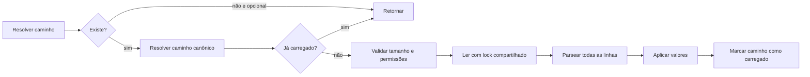

# EnvLoader

> Carregamento pequeno e defensivo de arquivos `.env` confiáveis.

[← Portal do ecossistema](../../README.md)

## Introdução

O EnvLoader lê pares `CHAVE=valor` e os publica no ambiente do processo e em `$_ENV`. Ele existe para scripts, ferramentas CLI, testes e aplicações pequenas que não precisam de um componente completo de configuração.

Use-o quando a entrada é um arquivo local controlado pela aplicação. Não o use como cofre de segredos, parser compatível com todas as variantes de dotenv, sistema de configuração hierárquica ou substituto para variáveis injetadas pela infraestrutura.

## Principais recursos

- ✅ zero dependências;
- ✅ valores string, inteiros e booleanos;
- ✅ comentários, `export` e aspas;
- ✅ preservação de variáveis existentes por padrão;
- ✅ limite de 1 MiB;
- ✅ lock compartilhado durante a leitura;
- ✅ verificação opcional de permissões Unix;
- ✅ carregamento idempotente por caminho canônico;
- ❌ sem interpolação `${VAR}`;
- ❌ sem valores multilinha;
- ❌ sem escrita de arquivos `.env`.

## Instalação

```bash
composer require omegaalfa/utils
```

Requer PHP 8.4+. Não exige extensões adicionais nem dependências de runtime.

## Início rápido

Arquivo `.env`:

```dotenv
APP_ENV=production
APP_DEBUG=false
HTTP_PORT=8080
APP_NAME="Omega API"
```

Aplicação:

```php
<?php

declare(strict_types=1);

require __DIR__ . '/vendor/autoload.php';

use Omegaalfa\Utils\EnvLoader\EnvLoader;

EnvLoader::load(__DIR__, required: true);

$environment = EnvLoader::require('APP_ENV');
$debug = EnvLoader::getBool('APP_DEBUG', false);
$port = EnvLoader::getInt('HTTP_PORT', 8080);
$name = EnvLoader::get('APP_NAME', 'Application');
```

## Conceitos

### Resolução do arquivo

`load()` aceita um arquivo ou um diretório. Quando recebe um diretório, acrescenta `.env`. Sem argumento, procura `.env` no diretório de execução retornado por `getcwd()`.

### Precedência

Ao consultar uma variável, a ordem é:

1. `$_ENV`;
2. ambiente do processo via `getenv()`;
3. `$_SERVER`;
4. valor padrão.

Durante o carregamento, qualquer valor já existente nessas fontes é preservado, salvo quando `overwrite: true`.

### Sintaxe suportada

```dotenv
# comentário
export APP_ENV=production
APP_NAME="Omega Utils" # comentário depois do valor
LITERAL='sem interpretação'
EMPTY=
ESCAPED="aspas: \" e barra: \\"
```

Aspas duplas reconhecem apenas escape de aspas e barra invertida. Aspas simples são literais. Interpolação, sequências como `\n` e continuação de linhas não são implementadas.

## Casos de uso

### Arquivo opcional em desenvolvimento

```php
EnvLoader::load(__DIR__ . '/.env');
```

A ausência do arquivo é ignorada.

### Configuração obrigatória de CLI

```php
EnvLoader::load('/etc/my-command/app.env', required: true);

$endpoint = EnvLoader::require('API_ENDPOINT');
$retries = EnvLoader::getInt('API_RETRIES', 3);
```

### Teste com sobrescrita explícita

```php
EnvLoader::load(__DIR__ . '/.env.testing', overwrite: true);
```

> [!NOTE]
> Um mesmo caminho canônico é processado uma única vez por processo. Alterar o arquivo e chamar `load()` novamente não o recarrega.

### Arquivo protegido em Unix

```php
EnvLoader::load(
    '/run/secrets/application.env',
    required: true,
    strictPermissions: true,
);
```

Use `chmod 600`. No Windows, a verificação Unix é ignorada.

## Guia completo da API

| Método | Retorno | Comportamento e falhas |
|---|---|---|
| `load(?string $path = null, bool $required = false, bool $overwrite = false, bool $strictPermissions = false)` | `void` | Carrega o arquivo. Lança `RuntimeException` para arquivo obrigatório ausente, ilegível, grande ou inseguro; `InvalidArgumentException` para sintaxe inválida. |
| `has(string $key)` | `bool` | Verifica todas as fontes. Chaves inválidas lançam `InvalidArgumentException`. |
| `get(string $key, ?string $default = null)` | `?string` | Retorna o valor seguindo a precedência. Valores escalares de superglobais são convertidos para string; outros geram `RuntimeException`. |
| `require(string $key)` | `string` | Exige valor presente e não vazio; caso contrário lança `RuntimeException`. |
| `getInt(string $key, ?int $default = null)` | `?int` | Aceita somente inteiro decimal opcionalmente negativo. |
| `getBool(string $key, ?bool $default = null)` | `?bool` | Verdadeiros: `1,true,yes,on`. Falsos: `0,false,no,off`, sem diferenciar maiúsculas. |

## Fluxo interno



O parse ocorre antes de qualquer variável ser aplicada. Assim, um erro de sintaxe não deixa o arquivo parcialmente carregado.

## Problemas que resolve

Sem o módulo, cada script tende a repetir leitura, parsing, precedência e validação de tipos. Com ele, essas regras ficam centralizadas e falham de forma previsível.

## Comparações

- **Variáveis do process manager:** continuam sendo a escolha preferida em produção; não requerem arquivo local.
- **vlucas/phpdotenv:** oferece sintaxe e recursos mais amplos, validação rica e ecossistema maduro, com maior superfície e dependências.
- **EnvLoader:** indicado quando a sintaxe deliberadamente pequena atende ao projeto e zero dependências é prioridade.

## Performance

Não há benchmark publicado. O arquivo é lido uma vez por caminho canônico, com limite de 1 MiB. Parsing e aplicação são lineares em relação ao tamanho do arquivo.

## Melhores práticas

- injete segredos pela infraestrutura em produção;
- mantenha `.env` fora do controle de versão;
- use `required: true` para configuração indispensável;
- use getters tipados em vez de casts espalhados;
- não dependa de recarregar o mesmo arquivo durante o processo;
- use permissões restritas em sistemas Unix.

## FAQ

**Os valores são interpolados?** Não.

**`getBool()` aceita `enabled`?** Não; somente os tokens documentados.

**Arquivo ausente sempre lança exception?** Somente com `required: true`.

**Posso carregar vários arquivos?** Sim, desde que tenham caminhos canônicos diferentes.

## Troubleshooting

| Mensagem | Causa | Solução |
|---|---|---|
| `Environment file not found` | Caminho obrigatório inexistente | Corrija o caminho ou remova `required: true`. |
| `Invalid .env entry` | Linha sem `=` | Use `KEY=value`. |
| `Unclosed quoted value` | Aspas não fechadas | Feche as aspas na mesma linha. |
| `permissions are too broad` | Bits de grupo/outros ativos | Execute `chmod 600 arquivo.env`. |
| `must be an integer/boolean` | Valor incompatível com getter | Corrija a configuração ou use `get()`. |

## Oportunidades de melhoria

- Introduzir um objeto de resultado imutável permitiria evitar mutação global, mas aumentaria a API.
- Um mecanismo explícito de reload seria útil em testes, desde que não comprometa a idempotência padrão.
- Interpolação poderia ser adicionada futuramente, porém exigiria regras de ciclo, escape e precedência bem definidas.
- Exceptions específicas melhorariam captura granular sem alterar o fluxo atual.

## Contribuição

Execute `composer check`. Novas sintaxes precisam de testes válidos e inválidos, documentação e análise de impacto de segurança.

## Licença

[MIT](../../LICENSE)
