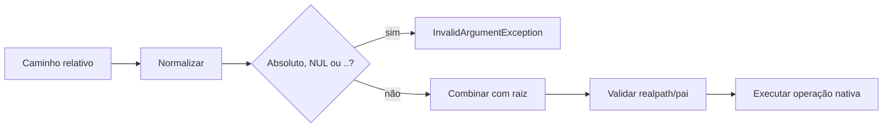

# Filesystem

> Camada root-scoped, segura e previsível sobre arquivos e diretórios nativos.

[← Portal](../../README.md)

## Introdução

Filesystem centraliza leitura, escrita, cópia, movimento, busca, streams, permissões e metadados. Todo caminho é relativo a uma raiz configurada.

Use-o para storage local de scripts, CLIs e micro-aplicações. Não o use para S3, FTP, mounts remotos não confiáveis ou remoção recursiva de diretórios.

## Recursos

- ✅ raiz isolada;
- ✅ bloqueio de caminhos absolutos, NUL e `..`;
- ✅ detecção de symlink que escapa da raiz;
- ✅ escrita atômica por padrão;
- ✅ overwrite explícito;
- ✅ listagem ordenada e recursiva;
- ✅ integração com `Stream`;
- ✅ tamanho, data e permissões;
- ❌ sem adapters remotos;
- ❌ sem delete recursivo.

## Instalação e início rápido

```bash
composer require omegaalfa/utils
```

```php
use Omegaalfa\Utils\Filesystem\Filesystem;

$filesystem = new Filesystem(__DIR__);

$filesystem->write('storage/log.txt', 'Conteúdo');
$filesystem->copy('arquivo.txt', 'backup/arquivo.txt');
$filesystem->delete('arquivo.txt');
```

PHP 8.4+, sem dependências adicionais.

## Conceitos

A raiz é resolvida com `realpath()`. Entradas são normalizadas lexicalmente e destinos têm o diretório pai novamente validado depois da criação. Caminhos absolutos e segmentos `..` são rejeitados.

A escrita atômica cria um temporário no mesmo diretório, grava, aplica permissões e usa `rename()`. Isso reduz arquivos parcialmente escritos; a semântica final depende do filesystem.

`write()` cria ou substitui o arquivo deliberadamente. Em `copy()` e `move()`, a substituição exige `overwrite: true`. O movimento preserva o destino em backup quando a plataforma não permite substituição atômica direta.

## Casos de uso

### Leitura e escrita

```php
$filesystem = new Filesystem('/var/lib/my-app');
$filesystem->write('cache/result.json', '{"ok":true}', permissions: 0640);

$json = $filesystem->read('cache/result.json');
```

### Busca

```php
$files = $filesystem->files('reports', recursive: true);

foreach ($files as $relativePath) {
    echo $relativePath . PHP_EOL;
}
```

### Stream incremental

```php
$stream = $filesystem->stream('imports/customers.csv');

foreach ($stream->csvRows() as $row) {
    // Uma linha por vez.
}

$stream->close();
```

### Movimento com overwrite explícito

```php
$filesystem->move(
    'staging/report.pdf',
    'reports/report.pdf',
    overwrite: true,
);
```

## API

| Método | Retorno | Observação |
|---|---|---|
| `__construct(?string $root = null)` | objeto | Usa cwd por padrão e cria raiz ausente. |
| `getRoot()` | `string` | Raiz canônica. |
| `exists(string $path)` | `bool` | Inclui links simbólicos. |
| `read(string $path)` | `string` | Exige arquivo legível dentro da raiz. |
| `write(string $path, string $contents, int $permissions = 0644, bool $atomic = true)` | `void` | Cria pais e cria ou substitui atomicamente por padrão. |
| `createDirectory(string $path, int $permissions = 0755, bool $recursive = true)` | `void` | Idempotente para diretório existente. |
| `copy(string $source, string $destination, bool $overwrite = false)` | `void` | Não sobrescreve implicitamente. |
| `move(...)` | `void` | Overwrite tenta substituição atômica e usa backup com rollback como fallback. |
| `delete(string $path)` | `void` | Arquivo/link; recusa diretórios. Ausência é idempotente. |
| `files(string $directory = '.', bool $recursive = false)` | `list<string>` | Caminhos relativos ordenados. |
| `size()`, `lastModified()`, `permissions()` | `int` | Metadados nativos. |
| `changePermissions(string $path, int $permissions)` | `void` | Intervalo 0000–0777. |
| `stream(string $path, string $mode = 'rb')` | `Stream` | Reutiliza o módulo Stream. |

## Fluxo



## Comparações e performance

A API nativa tem overhead mínimo, mas espalha tratamento de `false`, paths e permissões. Flysystem oferece adapters remotos e plugins, com escopo maior. Este módulo é local e root-scoped.

Não há benchmark publicado. Leitura completa aloca conforme o arquivo; `stream()` é indicado para grandes volumes. Atomic write faz uma gravação e um rename adicionais em troca de segurança.

## Boas práticas

- configure raiz dedicada;
- nunca derive a raiz diretamente do usuário;
- use streams para arquivos grandes;
- mantenha overwrite explícito;
- trate exceptions de I/O;
- não suponha que permissões Unix tenham igual efeito no Windows;
- não use como sandbox contra um processo hostil com acesso ao filesystem.

## FAQ e troubleshooting

**Posso usar caminho absoluto?** Não.

**Delete remove diretórios?** Não, por segurança.

**Por que symlink externo falha?** Para preservar a raiz.

| Erro | Ação |
|---|---|
| `Parent directory traversal is not allowed` | Remova `..`. |
| `Path does not exist inside filesystem root` | Corrija caminho ou symlink. |
| `Destination already exists` | Decida e passe `overwrite: true`. |
| `Unable to atomically replace` | Verifique permissões e semântica do mount. |

## Oportunidades de melhoria

Adapters remotos devem ser outro pacote. Delete recursivo exigiria API deliberadamente destrutiva. Cópia incremental entre streams e filtros de busca podem ser adicionados sem mudar a segurança da raiz. Benchmarks por filesystem ainda são necessários.

## Contribuição e licença

Execute `composer check`; cubra traversal, symlinks e falhas. Licença [MIT](../../LICENSE).
