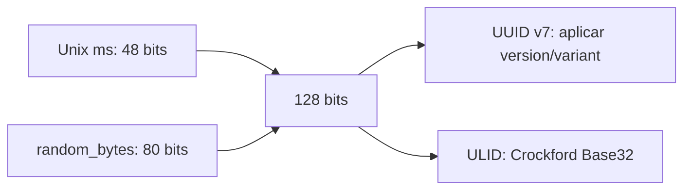

# UUID v7 e ULID

> Identificadores criptograficamente aleatórios com prefixo temporal ordenável.

[← Portal](../../README.md)

## Introdução

O módulo Identifier gera UUID versão 7 e ULID canônico sem banco ou bibliotecas. Ambos codificam timestamp Unix em milissegundos nos primeiros 48 bits, favorecendo índices aproximadamente ordenados.

Use-os como IDs públicos ou chaves distribuídas. Não os use como segredo, token de autenticação ou garantia absoluta de ordem dentro do mesmo milissegundo.

## Recursos

- ✅ UUID v7 com versão e variante RFC corretas;
- ✅ ULID Crockford Base32;
- ✅ `random_bytes()`;
- ✅ validação;
- ✅ extração do timestamp;
- ✅ zero dependências;
- ❌ sem modo monotônico;
- ❌ sem UUID v1/v3/v4/v5/v6/v8;
- ❌ sem parsing em value object.

## Instalação e início rápido

```bash
composer require omegaalfa/utils
```

```php
use Omegaalfa\Utils\Identifier\Ulid;
use Omegaalfa\Utils\Identifier\Uuid;

$uuid = Uuid::v7();
$ulid = Ulid::generate();

echo $uuid . PHP_EOL;
echo $ulid . PHP_EOL;
```

Requer PHP 8.4+.

## Conceitos

UUID v7 possui 128 bits e representação hexadecimal com hífens. ULID possui os mesmos 128 bits conceituais em 26 caracteres Crockford Base32, sem `I`, `L`, `O` ou `U`.

A ordenação lexical acompanha timestamps diferentes. IDs gerados no mesmo milissegundo recebem randomness independente e não são monotônicos entre si.

## Casos de uso

### Banco de dados

```php
$id = Uuid::v7();

$statement = $pdo->prepare(
    'INSERT INTO orders (id, customer_id) VALUES (:id, :customer)'
);
$statement->execute(['id' => $id, 'customer' => 42]);
```

### ULID em URL

```php
$id = Ulid::generate();
$url = '/events/' . $id;
```

### Timestamp

```php
$createdAtMilliseconds = Uuid::timestamp($uuid);
$alsoCreatedAt = Ulid::timestamp($ulid);
```

### Teste determinístico do prefixo temporal

```php
$uuid = Uuid::v7(1_700_000_000_000);
$ulid = Ulid::generate(1_700_000_000_000);
```

O argumento existe para controle temporal e testes; a parte aleatória continua segura.

## API

| API | Retorno | Falhas |
|---|---|---|
| `Uuid::v7(?int $timestampMilliseconds = null)` | `string` | Timestamp deve caber em 48 bits unsigned. |
| `Uuid::isValid(string $uuid)` | `bool` | Valida formato, versão 1–8 e variante RFC. |
| `Uuid::timestamp(string $uuid)` | `int` | Exige UUID v7 válido. |
| `Ulid::generate(?int $timestampMilliseconds = null)` | `string` | Gera formato canônico uppercase. |
| `Ulid::isValid(string $ulid)` | `bool` | Rejeita lowercase, caracteres ambíguos e overflow. |
| `Ulid::timestamp(string $ulid)` | `int` | Extrai milissegundos ou lança `InvalidArgumentException`. |

## Estrutura



## Performance e comparações

Não há benchmark publicado. Cada geração chama relógio, `random_bytes(10)` e codificação de tamanho fixo. ULID usa loops fixos sobre dez bytes; UUID usa `pack()`, operações de bits e `bin2hex()`.

IDs sequenciais do banco são menores, mas exigem coordenação central. UUID v4 não carrega ordem temporal. UUID v7 é padronizado e familiar; ULID é compacto e legível. Nenhum substitui constraints únicas no banco.

## Boas práticas

- mantenha índice UNIQUE;
- armazene UUID em binário quando o banco e a aplicação tiverem conversão consistente;
- não exponha timestamp como informação secreta;
- não use IDs como tokens;
- não suponha ordem determinística no mesmo milissegundo;
- gere no relógio real salvo em testes.

## FAQ e troubleshooting

**Pode colidir?** A probabilidade é extremamente baixa, não zero matemático.

**É monotônico?** Apenas aproximadamente por timestamp.

**ULID lowercase é aceito?** Não; o contrato é canônico uppercase.

| Erro | Solução |
|---|---|
| `Timestamp must fit in 48 unsigned bits` | Use milissegundos entre 0 e 2^48−1. |
| `Expected a valid UUID version 7` | Valide formato e versão. |
| `Expected a valid canonical ULID` | Use 26 caracteres uppercase Crockford. |

## Oportunidades de melhoria

Um gerador monotônico exigiria estado por processo e política para regressão do relógio. Value objects binários poderiam reduzir conversões em bancos, mas aumentariam a API. Outros UUIDs devem entrar somente por demanda concreta. Vetores oficiais adicionais fortaleceriam interoperabilidade.

## Contribuição e licença

Execute `composer check` e preserve bits, vetores temporais e randomness. Licença [MIT](../../LICENSE).
