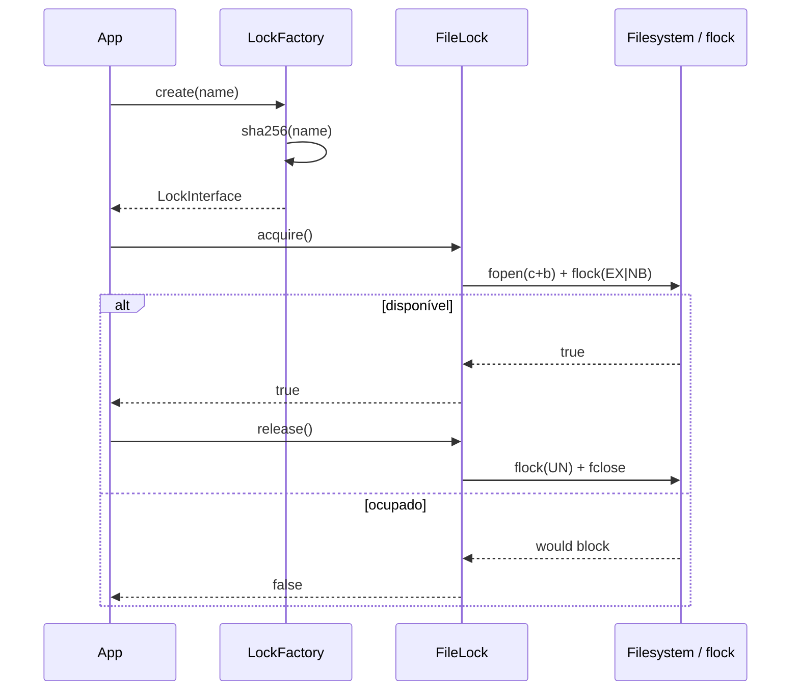

# Lock

> Exclusão mútua leve entre processos PHP que compartilham filesystem.

[← Portal do ecossistema](../../README.md)

## Introdução

O módulo Lock impede que duas execuções entrem simultaneamente na mesma seção crítica. Ele evita geração duplicada, concorrência sobre recursos exclusivos e corrupção causada por operações sobrepostas.

A implementação atual usa `flock()` e arquivos locais. Use-a em scripts CLI, cron jobs, workers e micro-aplicações executados na mesma máquina ou sobre um filesystem com locking confiável. Não a use como lock distribuído entre hosts, containers com discos isolados ou ambientes cujo filesystem não preserve corretamente a semântica de `flock()`.

## Principais recursos

- ✅ zero dependências adicionais;
- ✅ aquisição exclusiva e não bloqueante por padrão;
- ✅ modo bloqueante opcional;
- ✅ coordenação real entre processos;
- ✅ liberação explícita, idempotente e automática;
- ✅ nomes convertidos para SHA-256;
- ✅ diretório privado criado com modo `0700`;
- ✅ contrato `LockInterface` para backends futuros;
- ❌ sem timeout ou TTL;
- ❌ sem renovação automática;
- ❌ sem backend distribuído incluído;
- ❌ sem remoção automática dos arquivos persistentes.

## Instalação

```bash
composer require omegaalfa/utils
```

Requer PHP 8.4+ e uma implementação de filesystem compatível com `flock()`. Não adiciona pacotes Composer.

## Início rápido

```php
<?php

declare(strict_types=1);

require __DIR__ . '/vendor/autoload.php';

use Omegaalfa\Utils\Lock\LockFactory;

$lockFactory = new LockFactory();
$lock = $lockFactory->create('generate-monthly-report');

if (!$lock->acquire()) {
    throw new RuntimeException('Relatório já está sendo gerado.');
}

try {
    $reportService->generate();
} finally {
    $lock->release();
}
```

## Conceitos

### Seção crítica

A região entre `acquire()` e `release()` deve conter apenas a operação que não pode se sobrepor. Quanto menor ela for, menor o tempo de contenção.

### Lock não bloqueante

`acquire()` retorna imediatamente:

- `true`: esta instância possui o lock;
- `false`: outro processo possui o lock;
- `RuntimeException`: houve falha de I/O, não simples contenção.

### Lock bloqueante

`acquire(blocking: true)` espera até o sistema operacional liberar o arquivo. Não existe timeout interno; uma espera pode durar indefinidamente.

### Propriedade e lifecycle

Uma instância adquirida mantém o resource aberto. `release()` libera e fecha esse resource. O destructor tenta liberar como última proteção, mas `try/finally` continua sendo o mecanismo recomendado.

### Arquivos persistentes

O arquivo `.lock` não é apagado após a liberação. Removê-lo cria uma corrida: um processo pode continuar preso ao inode antigo enquanto outro cria e bloqueia um inode novo com o mesmo nome.

## Casos de uso

### Cron sem execução sobreposta

```php
$factory = new LockFactory('/var/lock/my-app');
$lock = $factory->create('billing:daily');

if (!$lock->acquire()) {
    fwrite(STDERR, "Billing job is already running.\n");
    exit(75);
}

try {
    $billingJob->run();
} finally {
    $lock->release();
}
```

### Operação por entidade

```php
$orderId = 42;
$lock = $factory->create("order:{$orderId}:capture");

if (!$lock->acquire()) {
    throw new RuntimeException('Payment capture is already in progress.');
}

try {
    $paymentService->capture($orderId);
} finally {
    $lock->release();
}
```

O nome original nunca vira caminho: a factory armazena `hash('sha256', $name) . '.lock'`.

### Espera deliberada

```php
$lock = $factory->create('exclusive-maintenance');
$lock->acquire(blocking: true);

try {
    $maintenance->execute();
} finally {
    $lock->release();
}
```

> [!WARNING]
> O modo bloqueante não possui timeout. Não o use em request HTTP sem controlar externamente o tempo máximo.

### Diretório customizado

```php
$factory = new LockFactory('/run/lock/my-application');

echo $factory->getDirectory();
```

O processo precisa de permissão de escrita. Um caminho existente que seja link simbólico é rejeitado.

## Guia completo da API

### `LockInterface`

| Método | Retorno | Contrato |
|---|---|---|
| `acquire(bool $blocking = false)` | `bool` | Adquire exclusividade; false representa contenção não bloqueante. |
| `release()` | `void` | Libera o lock. Deve aceitar chamadas repetidas. |
| `isAcquired()` | `bool` | Indica se esta instância possui o lock. |

### `LockFactory`

| API | Retorno | Falhas |
|---|---|---|
| `__construct(?string $directory = null)` | objeto | Usa `sys_get_temp_dir()/omegaalfa-locks` por padrão. Lança `InvalidArgumentException` para vazio e `RuntimeException` para symlink, criação ou permissão inválida. |
| `create(string $name)` | `LockInterface` | Nome vazio lança `InvalidArgumentException`. |
| `getDirectory()` | `string` | Caminho canônico validado. |

### `FileLock`

A factory é o ponto normal de criação. `FileLock` implementa o contrato usando `fopen('c+b')` e `flock(LOCK_EX)`.

- adquirir novamente na mesma instância retorna `true`;
- liberar sem aquisição não produz efeito;
- falhas de abertura, aquisição do SO ou release geram `RuntimeException`;
- a clonagem é impedida para não duplicar ownership do resource.

## Fluxo interno



## Problemas que resolve

Sem lock:

1. dois processos verificam o mesmo estado;
2. ambos concluem que podem prosseguir;
3. executam a operação duas vezes;
4. geram duplicidade ou corrupção.

Com lock:

1. o primeiro processo adquire exclusividade;
2. o segundo falha imediatamente ou aguarda;
3. somente um entra na seção crítica;
4. `finally` garante a liberação.

## Comparações e escolha de backend

| Backend | Indicado para | Limitações |
|---|---|---|
| Arquivo + `flock()` | Mesma máquina e filesystem local | Não distribuído; sem TTL. |
| Semáforo SysV | Processos no mesmo host | Requer extensão e lifecycle de IPC. |
| Redis | Vários hosts com Redis compartilhado | Exige algoritmo com token, TTL e renovação corretos. |
| Banco de dados | Infraestrutura já centralizada | Maior latência e semântica específica do banco. |

Este pacote implementa somente arquivo. Adaptadores Redis, banco e semáforo não são documentados como disponíveis.

## Performance

Não há benchmark publicado. O caminho de aquisição realiza hash SHA-256 durante `create()`, uma abertura de arquivo e uma chamada `flock()`. Não há polling, sleep, serialização ou alocação de contexto. A liberação executa unlock e close. Contenção e latência dependem do kernel e filesystem.

## Segurança e melhores práticas

- sempre libere em `finally`;
- mantenha a seção crítica curta;
- use nomes estáveis, incluindo o escopo da entidade;
- compartilhe o mesmo diretório entre processos que devem competir;
- não use diretório controlado por entrada externa;
- não remova arquivos de lock enquanto processos estiverem ativos;
- prefira aquisição não bloqueante em HTTP;
- monitore operações longas;
- use backend distribuído quando houver mais de um host;
- lembre que lock evita simultaneidade, não substitui idempotência no domínio.

## FAQ

**O arquivo vazio significa que o lock está livre?** Não. A trava pertence ao resource no kernel, não ao conteúdo.

**Posso apagar arquivos antigos?** Somente quando há garantia de que nenhum processo os abriu ou aguarda.

**O destructor é suficiente?** É uma proteção adicional; use `finally`.

**Funciona em Docker?** Apenas se os containers compartilharem um volume com locking compatível.

**Evita duplicidade para sempre?** Evita simultaneidade. Retentativas sequenciais ainda exigem idempotência.

## Troubleshooting

| Sintoma/mensagem | Causa | Solução |
|---|---|---|
| `acquire()` sempre retorna false | Outro processo mantém o mesmo nome | Identifique a operação longa ou nome excessivamente amplo. |
| `Unable to open lock file` | Permissão ou filesystem | Configure diretório gravável. |
| `Lock directory cannot be a symbolic link` | Caminho final é symlink | Use diretório real dedicado. |
| Locks não competem entre containers | Filesystems diferentes | Compartilhe volume ou use backend distribuído. |
| Request fica preso | Modo bloqueante sem timeout | Use modo padrão ou timeout externo. |

## Oportunidades de melhoria

- Um `RedisLock` precisaria de token de ownership, aquisição atômica, TTL e release compare-and-delete.
- Timeout monotônico poderia ser adicionado sobre tentativas não bloqueantes, com custo de polling deliberado.
- Metadados opcionais de diagnóstico poderiam registrar PID e horário, sem serem usados como fonte de verdade.
- Um adapter de banco deve documentar transações e advisory locks específicos do driver.
- Benchmarks entre ext4, tmpfs e volumes de container ajudariam a definir cenários recomendados.

## Contribuição

Execute `composer check`. Alterações precisam testar exclusão entre processos, contenção, release repetido, destructor e nomes hostis.

## Licença

[MIT](../../LICENSE)
