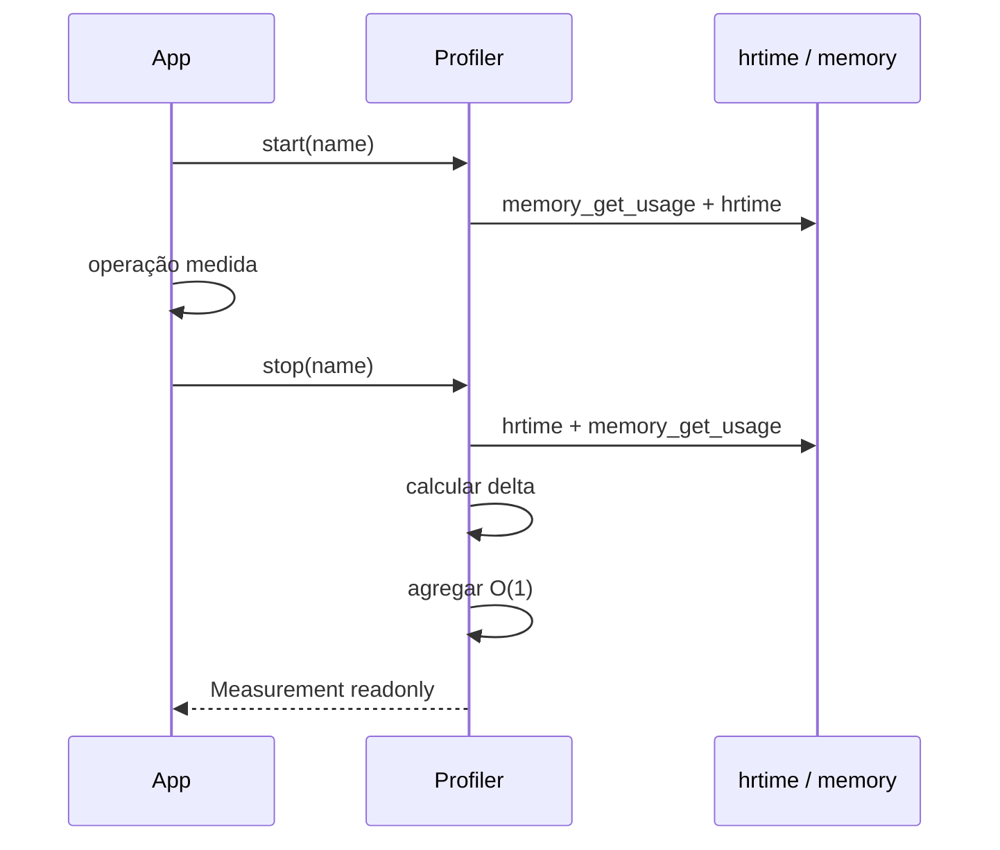

# Profiler

> Medições leves de tempo, memória, chamadas e etapas durante a execução.

[← Portal do ecossistema](../../README.md)

## Introdução

O Profiler instrumenta trechos nomeados para revelar onde uma aplicação realmente gasta tempo e memória. Ele usa relógio monotônico, preserva somente agregados por nome e permite ordenar operações pelo impacto total.

Use-o em scripts, comandos CLI, micro-aplicações, diagnóstico controlado e testes de desempenho relativos. Não o use como APM distribuído, tracing entre serviços, benchmark científico ou profiler de produção com armazenamento e interface visual.

## Principais recursos

- ✅ tempo monotônico em nanossegundos com `hrtime()`;
- ✅ delta de memória com `memory_get_usage()`;
- ✅ contagem de chamadas;
- ✅ total, mínimo, máximo e média por operação;
- ✅ etapas simultâneas com nomes diferentes;
- ✅ wrapper de callable seguro com `finally`;
- ✅ ranking por tempo total;
- ✅ snapshots readonly;
- ✅ agregação O(1) por medição;
- ✅ zero dependências adicionais;
- ❌ sem persistência ou exportador;
- ❌ sem tracing distribuído;
- ❌ sem histórico ilimitado de amostras.

## Instalação

```bash
composer require omegaalfa/utils
```

Requer PHP 8.4+. Não adiciona pacotes Composer ou extensões além das já exigidas pelo projeto.

## Início rápido

```php
<?php

declare(strict_types=1);

require __DIR__ . '/vendor/autoload.php';

use Omegaalfa\Utils\Profiler\Profiler;

$profiler = new Profiler();

$profiler->start('database-query');

$result = $repository->findAll();

$measurement = $profiler->stop('database-query');

printf(
    "Query: %.3f ms; memory delta: %d bytes\n",
    $measurement->durationMilliseconds(),
    $measurement->memoryDeltaBytes,
);
```

## Conceitos

### Relógio monotônico

Durações usam `hrtime(true)`, que não sofre ajustes do relógio civil, timezone ou sincronização NTP. Nanossegundos representam a unidade, não uma garantia de precisão física nessa escala.

### Delta de memória

O valor é `memory_get_usage()` no fim menos o valor no início. Ele é assinado: pode ser negativo se o trecho liberar mais memória do que alocar. Não representa pico de memória nem memória de processos externos.

### Agregação sem histórico

Cada `stop()` retorna uma amostra `Measurement`. O Profiler não guarda todas as amostras; atualiza um conjunto fixo de números por nome. Assim, memória cresce com a quantidade de nomes distintos, não com o número total de chamadas.

### Medições ativas

Um nome pode estar ativo apenas uma vez. Etapas com nomes diferentes podem se sobrepor, permitindo medir uma request e uma query dentro dela.

## Casos de uso

### Callable com liberação garantida

```php
$result = $profiler->measure(
    'repository.find-all',
    static fn (): array => $repository->findAll(),
);
```

A medição é encerrada mesmo se a callable lançar exception, e a mesma exception continua para o chamador.

### Pipeline por etapas

```php
$profiler->start('request');

$profiler->measure('validation', function () use ($validator, $input): void {
    $validator->validate($input);
});

$profiler->measure('database', function () use ($repository): void {
    $repository->save();
});

$profiler->stop('request');
```

### Quantidade e média

```php
for ($index = 0; $index < 100; $index++) {
    $profiler->measure(
        'serialize-item',
        static fn (): string => json_encode(['index' => $index], JSON_THROW_ON_ERROR),
    );
}

$entry = $profiler->get('serialize-item');

printf(
    "%d calls; average %.3f ms\n",
    $entry?->calls ?? 0,
    $entry?->averageDurationMilliseconds() ?? 0.0,
);
```

### Operações mais lentas

```php
foreach ($profiler->slowest(5) as $entry) {
    printf(
        "%s: %.3f ms total (%d calls)\n",
        $entry->name,
        $entry->totalDurationMilliseconds(),
        $entry->calls,
    );
}
```

O ranking usa tempo total acumulado, não máximo ou média.

### Reset entre unidades de trabalho

```php
$profiler->reset();
```

`reset()` descarta estatísticas e medições ainda ativas sem gerar amostras.

## Guia completo da API

### `Profiler`

| API | Retorno | Comportamento e falhas |
|---|---|---|
| `start(string $name)` | `void` | Inicia tempo e memória. Nome vazio gera `InvalidArgumentException`; nome já ativo gera `LogicException`. |
| `stop(string $name)` | `Measurement` | Encerra, agrega e retorna a amostra. Nome não ativo gera `LogicException`. |
| `measure(string $name, callable $operation)` | retorno da callable | Executa entre start/stop. Exceptions são propagadas sem wrapping. |
| `isActive(string $name)` | `bool` | Verifica se o nome está em andamento. |
| `get(string $name)` | `?ProfileEntry` | Snapshot agregado ou null. |
| `all()` | `array<string,ProfileEntry>` | Snapshot de todas as operações concluídas. |
| `slowest(int $limit = 10)` | `list<ProfileEntry>` | Ordena por tempo total decrescente. Limite menor que 1 é inválido. |
| `reset()` | `void` | Limpa todo o estado. |

### `Measurement`

Objeto readonly de uma única execução:

| Propriedade/método | Tipo |
|---|---|
| `name` | `string` |
| `durationNanoseconds` | `int` |
| `memoryDeltaBytes` | `int` assinado |
| `durationMilliseconds()` | `float` |

### `ProfileEntry`

Snapshot readonly agregado:

| Campo | Significado |
|---|---|
| `calls` | Quantidade de medições concluídas. |
| `totalDurationNanoseconds` | Soma das durações. |
| `minimumDurationNanoseconds` | Menor duração individual. |
| `maximumDurationNanoseconds` | Maior duração individual. |
| `totalMemoryDeltaBytes` | Soma algébrica dos deltas. |
| `averageDurationNanoseconds()` | Média em nanossegundos. |
| `averageDurationMilliseconds()` | Média em milissegundos. |
| `totalDurationMilliseconds()` | Total em milissegundos. |

## Fluxo interno



## Problemas que resolve

Sem medição, otimizações são guiadas por impressão. Uma operação que parece lenta pode ser chamada poucas vezes, enquanto uma operação pequena repetida milhares de vezes domina o tempo total.

Com o Profiler, a aplicação revela:

- duração individual;
- frequência;
- custo total;
- dispersão entre mínimo e máximo;
- alteração aproximada de memória;
- ranking dos pontos de maior impacto.

## Comparações

| Ferramenta | Escopo |
|---|---|
| `microtime(true)` manual | Medição pontual, exige agregação própria e usa relógio de parede. |
| Profiler | Instrumentação nomeada e agregada dentro do processo. |
| Xdebug Profiler | Perfil detalhado por função, com overhead e arquivos de trace. |
| Blackfire/Tideways | Profiling/APM avançado, visualização e infraestrutura externa. |
| OpenTelemetry | Tracing e métricas distribuídas; problema e custo maiores. |

## Performance

Não há benchmark publicado. Cada ciclo manual executa duas leituras de relógio, duas leituras de memória, acessos a arrays e uma alocação de `Measurement`. A agregação não armazena histórico. `all()` e `slowest()` alocam snapshots; `slowest()` custa O(n log n) sobre a quantidade de nomes distintos.

O próprio profiler introduz overhead. Não use resultados com Xdebug habilitado como representação direta de produção.

## Melhores práticas

- meça blocos relevantes, não cada operação trivial;
- use nomes estáveis e com baixa cardinalidade;
- evite IDs de usuário ou request no nome;
- compare cenários no mesmo ambiente;
- aqueça caches antes de conclusões;
- execute várias chamadas e observe total, média, mínimo e máximo;
- mantenha instrumentação fora de hot paths extremamente curtos;
- use `measure()` quando uma callable expressa bem o bloco;
- faça reset entre jobs independentes em workers persistentes.

## FAQ

**Memória negativa é erro?** Não; significa liberação líquida no intervalo.

**É possível iniciar o mesmo nome duas vezes?** Não. Use nomes diferentes para etapas sobrepostas.

**O ranking mostra a chamada individual mais lenta?** Não; ordena pelo total agregado.

**Exceptions são engolidas por `measure()`?** Não.

**Pode substituir um APM?** Não.

## Troubleshooting

| Sintoma/mensagem | Causa | Solução |
|---|---|---|
| `Measurement ... is already active` | Start duplicado sem stop | Corrija o lifecycle ou use nomes distintos. |
| `Measurement ... is not active` | Stop ausente/duplicado | Pare somente medições iniciadas. |
| Valores muito maiores em desenvolvimento | Xdebug ou carga do ambiente | Compare com extensões e carga equivalentes. |
| Memória não acompanha RSS | Métrica é do allocator PHP | Use ferramenta de processo para RSS. |
| Muitos nomes consomem memória | Cardinalidade dinâmica | Normalize os nomes e armazene IDs fora do profiler. |

## Oportunidades de melhoria

- Ranking configurável por total, média ou máximo poderia ser adicionado com enum explícito.
- Pico de memória por etapa exigiria outra semântica; `memory_get_peak_usage()` é global e não reinicia por bloco.
- Exportadores JSON ou Prometheus devem ficar opcionais para não aumentar o núcleo.
- Percentis exigiriam amostras ou algoritmo aproximado, elevando memória e complexidade.
- Benchmarks devem quantificar overhead com e sem Xdebug antes de novas otimizações.

## Contribuição

Execute `composer check`. Mudanças precisam manter o relógio monotônico, a cardinalidade limitada aos nomes e cobertura de exceptions e agregação.

## Licença

[MIT](../../LICENSE)
