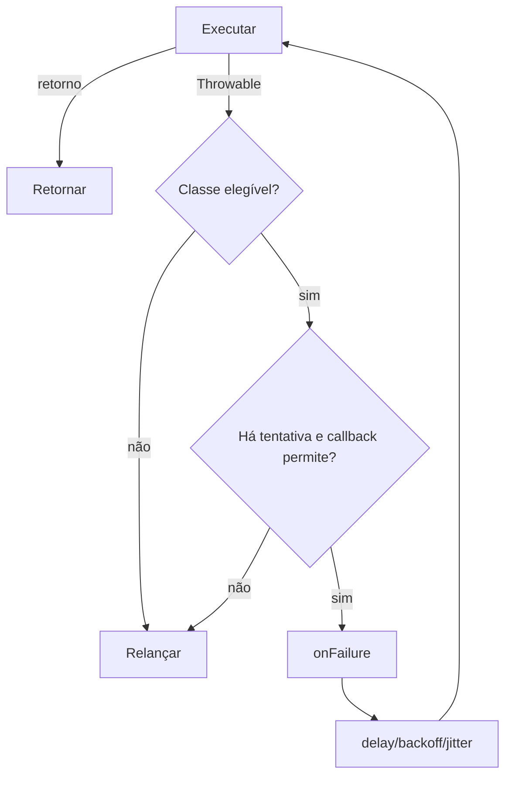

# Retry

> Reexecução controlada de operações sujeitas a falhas temporárias.

[← Portal](../../README.md)

## Introdução

Retry repete uma callable quando ela lança uma exception elegível. Suporta intervalo, backoff, jitter, filtro de classes, decisão dinâmica e callback de falha.

Use em APIs, filas, conexões e operações idempotentes com falhas transitórias. Não use para erros de programação, validação, autorização ou operações que podem duplicar efeitos sem idempotência.

## Recursos

- ✅ quantidade máxima;
- ✅ delay fixo ou exponencial;
- ✅ full jitter;
- ✅ limite de delay;
- ✅ classes retryable;
- ✅ cancelamento por callback;
- ✅ callback por falha;
- ✅ preserva retorno e mesma exception;
- ✅ zero dependências.

## Início rápido

```php
use Omegaalfa\Utils\Retry\Retry;

$result = Retry::attempt(
    operation: fn () => $httpClient->get($url),
    attempts: 3,
);
```

PHP 8.4+.

## Estratégia

Após uma falha, Retry verifica classe, tentativas restantes e `shouldRetry`. Se continuar, espera o delay — ou um valor aleatório entre zero e ele quando jitter está ativo — e multiplica o próximo delay até o máximo.



## Casos de uso

### Backoff exponencial com jitter

```php
$response = Retry::attempt(
    operation: fn () => $client->send($request),
    attempts: 5,
    delayMilliseconds: 100,
    multiplier: 2.0,
    jitter: true,
    maxDelayMilliseconds: 5_000,
);
```

### Seleção de exceptions

```php
$result = Retry::attempt(
    operation: fn () => $repository->fetch(),
    retryOn: [
        ConnectionException::class,
        TimeoutException::class,
    ],
);
```

### Cancelamento e observabilidade

```php
$result = Retry::attempt(
    operation: fn () => $service->call(),
    attempts: 4,
    shouldRetry: static fn (Throwable $error, int $attempt): bool =>
        $error->getCode() !== 401,
    onFailure: static function (
        Throwable $error,
        int $attempt,
        bool $willRetry,
    ): void {
        error_log("attempt={$attempt}; retry=" . ($willRetry ? 'yes' : 'no'));
    },
);
```

## API

`Retry::attempt()` recebe:

| Parâmetro | Padrão | Significado |
|---|---:|---|
| `operation` | obrigatório | Callable sem argumentos. |
| `attempts` | 3 | Total, incluindo a primeira execução. |
| `delayMilliseconds` | 0 | Espera inicial. |
| `multiplier` | 2.0 | Fator do próximo delay, mínimo 1.0. |
| `jitter` | false | Sorteia de 0 até o delay atual. |
| `retryOn` | `[Throwable::class]` | Classes elegíveis. |
| `shouldRetry` | null | `callable(Throwable,int): bool`. |
| `onFailure` | null | `callable(Throwable,int,bool): void`. |
| `maxDelayMilliseconds` | 60000 | Teto de todos os intervalos; deve ser maior ou igual ao delay inicial. |

Retorna exatamente o retorno da callable. Quando encerra por falha, relança a mesma instância de exception.

## Performance e limitações

Não há benchmark. O caminho de sucesso faz uma chamada e retorna. Falhas adicionam verificação linear sobre poucas classes, callbacks opcionais e `usleep()`. Jitter usa `random_int()`.

O método é síncrono e bloqueia a thread durante delay. Não possui budget total, deadline ou integração com event loop.

## Boas práticas

- aplique somente a operações idempotentes;
- selecione exceptions transitórias;
- use jitter em clientes concorrentes;
- defina timeouts na operação interna;
- limite tentativas e delay máximo;
- registre a última falha sem expor segredos;
- não retry em 4xx permanentes ou validação.

## FAQ e troubleshooting

**Attempts inclui a primeira chamada?** Sim.

**OnFailure roda na última falha?** Sim, com `willRetry=false`.

**Cancellation lança exception própria?** Não; relança a falha atual.

| Problema | Solução |
|---|---|
| Operação duplicada | Torne-a idempotente antes de retry. |
| Worker bloqueado | Reduza delay ou use solução async. |
| Todos os erros repetem | Restrinja `retryOn`. |
| Thundering herd | Ative jitter. |
| Initial delay cannot exceed the maximum delay | Aumente o máximo ou reduza o delay inicial. |

## Oportunidades de melhoria

Deadline monotônico, estratégia como enum/value object e integração async devem ser APIs separadas. Um callback de sleep injetável melhoraria testes determinísticos, mas adicionaria indireção ao hot path. Métricas podem integrar o Profiler sem criar dependência obrigatória.

## Contribuição e licença

Execute `composer check`; teste retorno, mesma exception e decisões. Licença [MIT](../../LICENSE).
