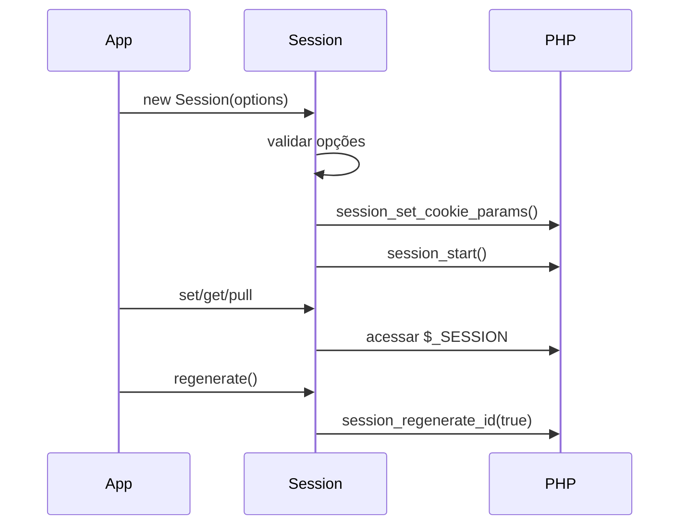

# Session

> Camada pequena sobre sessões nativas do PHP, sem conversão silenciosa de valores.

[← Portal do ecossistema](../../README.md)

## Introdução

Session organiza o ciclo de vida e o acesso a `$_SESSION`, preservando os tipos armazenados. Ela existe para aplicações HTTP pequenas que desejam defaults seguros de cookie e uma API testável sem adotar um framework.

Use-a para estado efêmero associado a uma sessão PHP. Não a use como banco de dados, cache distribuído, mecanismo de autorização, proteção CSRF ou armazenamento de dados sensíveis de longa duração.

## Principais recursos

- ✅ tipos nativos preservados;
- ✅ início automático opcional;
- ✅ cookies `HttpOnly` e `SameSite=Lax` por padrão;
- ✅ detecção automática de HTTPS para `Secure`;
- ✅ validação de `SameSite=None`;
- ✅ regeneração explícita de ID;
- ✅ get, set, has, pull, delete e clear;
- ✅ instância compartilhada opcional;
- ❌ sem escape de saída;
- ❌ sem flash bags ou namespaces;
- ❌ sem handler de persistência próprio.

## Instalação

```bash
composer require omegaalfa/utils
```

Requer PHP 8.4+ e suporte nativo a sessões habilitado.

## Início rápido

```php
<?php

declare(strict_types=1);

require __DIR__ . '/vendor/autoload.php';

use Omegaalfa\Utils\Session\Session;

$session = new Session();

$session->set('user', [
    'id' => 42,
    'name' => 'Ada',
]);

$user = $session->get('user');
echo $user['name'];
```

## Conceitos

### Dados não são transformados

Arrays permanecem arrays, inteiros permanecem inteiros e strings não são interpretadas como JSON. O módulo não executa `htmlspecialchars()`: escape depende do destino — HTML, atributo, JavaScript, URL e SQL possuem regras diferentes.

```php
$name = (string) $session->get('name', '');

echo htmlspecialchars($name, ENT_QUOTES | ENT_HTML5, 'UTF-8');
```

### Início automático

O construtor inicia a sessão por padrão. Use `autoStart: false` somente quando outro componente já controla `session_start()`. Todas as operações de dados exigem uma sessão ativa e falham explicitamente sem ela.

### Regeneração explícita

O ID não muda no construtor. Chame `regenerate()` depois de autenticação ou mudança de privilégio, quando a aplicação conhece o momento correto.

## Casos de uso

### Cookies restritos

```php
$session = new Session(cookieOptions: [
    'lifetime' => 0,
    'path' => '/',
    'domain' => '',
    'secure' => true,
    'httponly' => true,
    'samesite' => 'Strict',
]);
```

Valores aceitos por `samesite`: `Lax`, `Strict` e `None`. `None` exige `secure: true`.

### Valor de uso único

```php
$session->set('oauth_state', bin2hex(random_bytes(32)));

// Em outra requisição:
$state = $session->pull('oauth_state');

if ($state === null) {
    throw new RuntimeException('OAuth state is missing.');
}
```

### Valor padrão sem perder null explícito

```php
$session->set('optional', null);

$existing = $session->get('optional', 'fallback'); // null
$missing = $session->get('absent', 'fallback');   // fallback
```

### Integração com ciclo externo

```php
session_start();

$session = new Session(autoStart: false);
$session->set('request_id', 'req-123');
```

Atrás de um proxy reverso confiável, informe `secure: true` explicitamente. O módulo não confia automaticamente em headers encaminhados, pois eles precisam de uma política de proxies confiáveis.

## Guia completo da API

| API | Retorno | Comportamento e falhas |
|---|---|---|
| `__construct(bool $autoStart = true, array $cookieOptions = [])` | objeto | Inicia a sessão opcionalmente. |
| `instance()` | `Session` | Singleton iniciado com opções padrão na primeira chamada. |
| `start(array $cookieOptions = [])` | `void` | Idempotente se já ativa. Lança para sessões desabilitadas, headers enviados, opções inválidas ou falha nativa. |
| `regenerate(bool $deleteOldSession = true)` | `void` | Exige sessão ativa e troca o ID. |
| `set(string $key, mixed $value)` | `void` | Exige sessão ativa; armazena sem conversão. Chave vazia é inválida. |
| `get(string $key, mixed $default = null)` | `mixed` | Distingue chave ausente de valor `null`. |
| `has(string $key)` | `bool` | Usa `array_key_exists()`; `null` conta como existente. |
| `delete(string $key)` | `void` | Remove uma chave. |
| `pull(string $key, mixed $default = null)` | `mixed` | Obtém e remove a chave. |
| `clear()` | `void` | Substitui `$_SESSION` por array vazio. |
| `getAll()` / `all()` | `array` | Retornam todos os dados. |
| `destroy()` | `void` | Exige sessão ativa, expira o cookie quando usado, limpa dados e destrói a sessão. |

## Fluxo interno



## Problemas que resolve

Sem o módulo, defaults de cookie, verificação de estado e distinção entre valor ausente e `null` se espalham pela aplicação. Com ele, essas decisões ficam centralizadas sem alterar o formato nativo dos dados.

## Comparações

- **API nativa:** zero camada e máxima flexibilidade; exige disciplina repetida.
- **Sessão de frameworks:** oferece flash, middleware, stores e integração, com maior acoplamento.
- **Session:** apropriada quando o handler nativo basta e uma API pequena é desejada.

## Performance

Não há benchmark publicado. Operações de dados são acessos diretos a `$_SESSION`. O custo principal pertence ao handler configurado pelo PHP durante `session_start()` e persistência. O módulo não serializa JSON e evita alocações intermediárias.

## Segurança e melhores práticas

- regenere o ID após login e elevação de privilégio;
- use HTTPS e `secure: true` em produção;
- mantenha `httponly: true`;
- implemente proteção CSRF separadamente;
- armazene identificadores, não objetos ou segredos duradouros;
- escape somente ao produzir a saída;
- não aceite opções de cookie diretamente de entrada do usuário;
- inicie a sessão antes de enviar qualquer conteúdo.

> [!WARNING]
> `Session` não implementa autenticação, autorização nem CSRF. Ela apenas gerencia estado de sessão.

## FAQ

**Por que strings não são escapadas ao salvar?** Porque escape depende do contexto de saída.

**`has()` retorna true para null?** Sim.

**Posso chamar `start()` duas vezes?** Sim; se já estiver ativa, a chamada retorna sem alterar opções.

**O singleton aceita configuração?** Não. Use o construtor para opções personalizadas.

## Troubleshooting

| Mensagem | Causa | Solução |
|---|---|---|
| `Cannot start session after headers were sent` | Houve saída anterior | Inicie antes de HTML, echo ou BOM. |
| `PHP sessions are disabled` | Configuração do PHP | Habilite sessions no ambiente. |
| `SameSite=None requires a secure cookie` | Combinação rejeitada por browsers | Defina `secure: true` e use HTTPS. |
| `No active PHP session` | Operação de dados ou lifecycle sem início | Chame `start()` ou use auto start. |
| `Session key cannot be empty` | Chave vazia | Use uma chave estável e não vazia. |

## Oportunidades de melhoria

- Um método `close()` baseado em `session_write_close()` reduziria lock em requisições longas.
- Um factory configurável poderia substituir o singleton rígido e melhorar DX em containers.
- Flash data pode ser útil, mas deve permanecer fora do núcleo até existir um contrato simples e testado.
- Exceptions específicas permitiriam tratamento granular de configuração e lifecycle.

## Contribuição

Execute `composer check`. Testes que iniciam sessões devem rodar isoladamente para não compartilhar headers ou estado global.

## Licença

[MIT](../../LICENSE)
