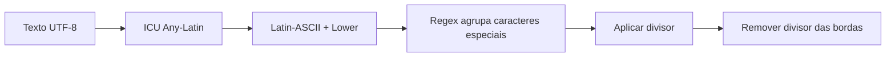

# String Utils — `Str`

> Operações estáticas de string com foco em baixo overhead e contratos explícitos.

[← Portal do ecossistema](../../README.md)

## Introdução

`Omegaalfa\Utils\Str` reúne verificações, slug, truncamento UTF-8, geração aleatória e mascaramento byte-oriented. A classe usa funções nativas implementadas em C sempre que possível.

Use-a em scripts, CLIs e micro-aplicações que precisam dessas operações sem instanciar serviços. Não a use como biblioteca Unicode completa, formatador de texto localizado ou substituto para componentes de segurança de domínio.

## Recursos

- ✅ métodos públicos e estáticos;
- ✅ funções nativas de contains/prefix/suffix;
- ✅ transliteração ICU via `intl`;
- ✅ truncamento UTF-8 via `mbstring`;
- ✅ aleatoriedade criptográfica;
- ✅ máscara com substituição direta;
- ✅ zero pacotes Composer em runtime;
- ❌ máscara não é multibyte;
- ❌ random usa somente alfabeto hexadecimal;
- ❌ slug aceita divisor ASCII de um byte.

## Instalação

```bash
composer require omegaalfa/utils
```

Requisitos:

- PHP 8.4+;
- `ext-intl`;
- `ext-mbstring`.

## Início rápido

```php
<?php

declare(strict_types=1);

require __DIR__ . '/vendor/autoload.php';

use Omegaalfa\Utils\Str\Str;

$slug = Str::slugify('Olá, São Paulo!');
$short = Str::truncate('Uma mensagem longa 🚀', 12);
$token = Str::random(32);
$card = Str::mask('4111111111111111', '*', 6, 6);
```

## Conceitos e limitações

`contains()`, `startsWith()` e `endsWith()` seguem exatamente a semântica nativa, incluindo needle vazio como correspondência válida.

`truncate()` mede caracteres UTF-8, mas o sufixo é acrescentado depois do limite. Portanto, `truncate('abcdef', 3)` retorna `abc...`, não uma string total de três caracteres.

`mask()` é deliberadamente byte-oriented para cartões, tokens e identificadores ASCII. Usá-la sobre caracteres UTF-8 multibyte pode cortar bytes no meio de um caractere.

## Casos de uso

### Verificações sem regex

```php
if (Str::startsWith($route, '/api/')) {
    // API route
}

if (Str::endsWith($filename, '.json')) {
    // JSON file
}
```

### Slug com divisor customizado

```php
$slug = Str::slugify('Crème brûlée — Guia', '_');
// creme_brulee_guia
```

O divisor deve possuir exatamente um byte ASCII e não pode ser alfanumérico.

### Token hexadecimal

```php
$token = Str::random(64);

// 64 caracteres hexadecimais produzidos por random_bytes().
```

### Mascaramento para logs

```php
$masked = Str::mask('4111111111111111', '*', 6, 6);
// 411111******1111

$ending = Str::mask('secret-token', '*', -5);
// secret-*****
```

## API completa

| Método | Retorno | Contrato |
|---|---|---|
| `contains(string $haystack, string $needle)` | `bool` | Delega a `str_contains()`. |
| `startsWith(string $haystack, string $needle)` | `bool` | Delega a `str_starts_with()`. |
| `endsWith(string $haystack, string $needle)` | `bool` | Delega a `str_ends_with()`. |
| `slugify(string $text, string $divider = '-')` | `string` | Translitera com ICU, converte para minúsculas e reduz caracteres especiais ao divisor. Divisor inválido gera `InvalidArgumentException`. |
| `truncate(string $text, int $length, string $append = '...')` | `string` | Preserva caracteres UTF-8. Comprimento negativo gera `InvalidArgumentException`. |
| `random(int $length = 16)` | `string` | Retorna exatamente o tamanho solicitado em hexadecimal. Comprimento negativo é inválido; zero retorna vazio. |
| `mask(string $string, string $character, int $index, ?int $length = null)` | `string` | Mascara bytes desde índice positivo ou negativo. Caractere deve ter um byte e comprimento não pode ser negativo. |

## Fluxo de slug



## Performance

Não há benchmark publicado. Os três métodos de consulta delegam diretamente às funções nativas. `random()` calcula `ceil(length / 2)` sem ponto flutuante e corta uma única vez. `mask()` usa `strlen`, `str_repeat` e `substr_replace`. `slugify()` executa transliteração ICU e uma regex inevitável; `truncate()` percorre UTF-8 com mbstring.

## Melhores práticas

- use `random()` para tokens hexadecimais, mas armazene hashes quando forem credenciais;
- aplique limite razoável a comprimentos vindos do usuário;
- use `mask()` somente para conteúdo ASCII;
- não confunda mascaramento com criptografia ou anonimização;
- não use slug como identificador único sem estratégia de colisão;
- valide UTF-8 na fronteira da aplicação.

## FAQ

**`random()` pode retornar letras fora de a–f?** Não, o alfabeto é hexadecimal minúsculo.

**O append conta no limite de truncate?** Não.

**Slug suporta divisor com vários caracteres?** Não, para manter trim e substituição diretos.

**Mask suporta emoji como caractere de máscara?** Não; exige um byte.

## Troubleshooting

| Problema | Causa | Solução |
|---|---|---|
| `Call to undefined function transliterator_transliterate` | `ext-intl` ausente | Instale/habilite intl. |
| `Call to undefined function mb_substr` | `ext-mbstring` ausente | Instale/habilite mbstring. |
| `Slug divider...` | Divisor vazio, multibyte, múltiplo ou alfanumérico | Use `-`, `_` ou outro separador ASCII. |
| Máscara corrompe UTF-8 | Operação byte-oriented | Use solução multibyte específica. |

## Oportunidades de melhoria

- Um `maskUtf8()` separado evitaria comprometer o hot path ASCII.
- Benchmarks podem comparar ICU com alternativas manuais em datasets reais.
- Um gerador com alfabeto configurável seria outro contrato e deve permanecer separado de `random()`.
- Cache de transliterator poderia reduzir setup em chamadas repetidas, mas precisa ser medido antes de adicionar estado estático.

## Contribuição

Execute `composer check` com `intl` e `mbstring` habilitadas. Casos novos devem cobrir ASCII, UTF-8, limites vazios e argumentos inválidos.

## Licença

[MIT](../../LICENSE)
