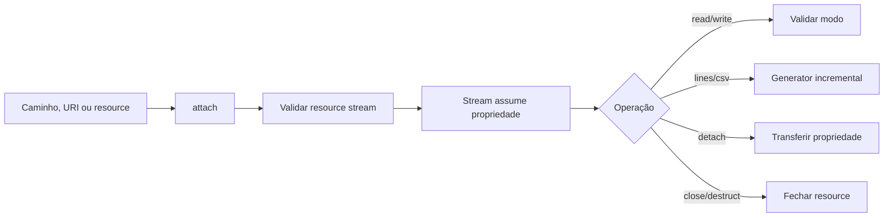

# Stream

> Wrapper tipado e sem dependências para resources de stream do PHP.

[← Portal do ecossistema](../../README.md)

## Introdução

O módulo Stream centraliza abertura, propriedade, leitura, escrita e iteração de streams nativos. Ele reduz validações repetidas sem substituir a API de streams do PHP.

Use-o para arquivos, `php://memory`, `php://temp`, sockets já abertos e processamento incremental de linhas ou CSV. Não o use quando precisa de uma implementação PSR-7, I/O assíncrono, buffering avançado ou abstração de filesystem.

## Principais recursos

- ✅ zero dependências;
- ✅ aceita URI/caminho ou resource existente;
- ✅ leitura e escrita conforme o modo;
- ✅ linhas e CSV por generators;
- ✅ metadados, tamanho e cursor;
- ✅ transferência explícita de propriedade com `detach()`;
- ✅ fechamento idempotente;
- ❌ não implementa `Psr\Http\Message\StreamInterface`;
- ❌ não oferece I/O assíncrono;
- ❌ não aplica limites ao conteúdo lido por `getContents()`.

## Instalação

```bash
composer require omegaalfa/utils
```

Requer PHP 8.4+. Usa somente funções e classes nativas.

## Início rápido

```php
<?php

declare(strict_types=1);

require __DIR__ . '/vendor/autoload.php';

use Omegaalfa\Utils\Stream\Stream;

$stream = new Stream('php://temp', 'r+b');
$stream->write("first line\nsecond line\n");

foreach ($stream->lines() as $line) {
    echo $line;
}

$stream->close();
```

Resultado:

```text
first line
second line
```

## Conceitos

### Propriedade do resource

Ao construir com um resource existente, o objeto assume sua propriedade. `close()` e o destrutor o fecham. Use `detach()` quando o chamador precisar recuperar a responsabilidade por fechá-lo.

### Cursor

Operações de leitura usam a posição atual. `lines()`, `csvRows()` e `countLines()` rebobinam por padrão. Elas deixam o cursor no final. `__toString()` também tenta rebobinar antes de ler.

### Processamento incremental

Generators produzem uma linha por vez. Isso evita materializar o arquivo completo, embora a memória de cada linha ou registro ainda dependa do tamanho individual desse item.

## Casos de uso

### Arquivo local

```php
use Omegaalfa\Utils\Stream\Stream;

$stream = new Stream(__DIR__ . '/input.log', 'rb');

try {
    while (!$stream->eof()) {
        $chunk = $stream->read(8192);
        // processar $chunk
    }
} finally {
    $stream->close();
}
```

### CSV grande

```php
$stream = new Stream(__DIR__ . '/customers.csv', 'rb');

foreach ($stream->csvRows(separator: ';') as $row) {
    [$id, $email] = $row;
    // processar uma linha sem carregar o arquivo inteiro
}
```

### Resource criado pela aplicação

```php
$resource = fopen('php://memory', 'r+b');
if ($resource === false) {
    throw new RuntimeException('Unable to create memory stream.');
}

$stream = new Stream($resource);
$stream->write('payload');
$stream->rewind();

echo $stream->getContents();
```

### Transferência de propriedade

```php
$resource = $stream->detach();

if ($resource !== null) {
    // Agora o chamador deve fechar o resource.
    fclose($resource);
}
```

## Guia completo da API

### Construção e ciclo de vida

| API | Retorno | Observações |
|---|---|---|
| `__construct(mixed $resource = 'php://temp', string $mode = 'r+b')` | objeto | String é aberta com `fopen`; resource deve ser do tipo stream. |
| `attach(mixed $resource, string $mode = 'r+b')` | `void` | Abre/assume o novo resource e fecha o anterior. |
| `getResource()` | `resource` | Lança `RuntimeException` se fechado ou detached. |
| `detach()` | `resource|null` | Remove sem fechar. |
| `close()` | `void` | Fecha uma vez; chamadas posteriores são seguras. |
| `__toString()` | `string` | Retorna todo conteúdo legível; por contrato nunca propaga `RuntimeException`. |

### Estado e cursor

| API | Retorno | Observações |
|---|---|---|
| `getSize()` | `?int` | Usa `fstat()`; tamanho pode ser desconhecido. |
| `tell()` | `int` | Posição atual ou `RuntimeException`. |
| `eof()` | `bool` | Estado EOF nativo. |
| `isSeekable()` | `bool` | Consulta metadados. |
| `seek(int $offset, int $whence = SEEK_SET)` | `void` | Lança se não for seekable ou falhar. |
| `rewind()` | `void` | Equivale a `seek(0)`. |
| `getMetadata(?string $key = null)` | `mixed` | Array completo, valor da chave ou `null`. |

### I/O

| API | Retorno | Observações |
|---|---|---|
| `isReadable()` | `bool` | Interpreta o modo nativo. |
| `isWritable()` | `bool` | Interpreta o modo nativo. |
| `read(int $length)` | `string` | Zero retorna string vazia; negativo é inválido. |
| `write(string $data)` | `int` | Retorna bytes gravados; escrita parcial é possível como em `fwrite()`. |
| `getContents()` | `string` | Lê da posição atual até EOF. |
| `lines(bool $rewind = true)` | `Generator<int,string>` | Produz linhas mantendo terminadores. |
| `csvRows(...)` | `Generator<int,list<string|null>>` | Produz registros via `fgetcsv()`; controles devem ter um byte. |
| `countLines()` | `int` | Percorre todo o stream a partir do início. |

## Fluxo interno



## Problemas que resolve

Sem o módulo, cada chamada precisa repetir verificações de `false`, modo, cursor e propriedade. Com ele, falhas viram exceptions consistentes e a iteração incremental possui uma API única.

## Comparações

- **Streams nativos:** menor overhead e máxima flexibilidade, mas exigem validação manual.
- **PSR-7 StreamInterface:** contrato de interoperabilidade HTTP; este módulo deliberadamente não o implementa.
- **Flysystem:** abstração completa de filesystem e adapters; resolve um problema mais amplo.
- **Stream:** wrapper pequeno para um resource dentro do mesmo processo.

## Performance

Não há benchmark publicado. `read()`, `write()` e acesso a metadados delegam às funções nativas. A fila de dados não é copiada pelo wrapper. `lines()` e `csvRows()` mantêm processamento incremental; `getContents()` e cast para string podem consumir memória proporcional ao restante do stream.

## Melhores práticas

- use `try/finally` ou permita que o destrutor feche o resource;
- prefira chunks ou generators para entradas grandes;
- não faça cast para string em conteúdo não limitado;
- verifique o número de bytes retornado por `write()`;
- passe `rewind: false` ao continuar da posição atual;
- não abra URLs não confiáveis como streams sem políticas de rede próprias.

## FAQ

**É compatível com PSR-7?** Não.

**O objeto fecha um resource fornecido externamente?** Sim, salvo após `detach()`.

**Generators fecham o stream?** Não.

**`getContents()` lê desde o começo?** Não; lê da posição atual. O cast para string tenta voltar ao começo.

## Troubleshooting

| Mensagem | Causa | Solução |
|---|---|---|
| `Unable to open stream` | Caminho, wrapper ou modo inválido | Confirme URI, permissões e modo. |
| `Stream is not writable` | Modo somente leitura | Abra com `w`, `a`, `c` ou `+`. |
| `Stream is detached or closed` | Uso após `detach()`/`close()` | Anexe outro resource ou não reutilize o objeto. |
| `Unable to seek` | Stream não seekable | Processe da posição atual e use `rewind: false`. |
| `CSV controls must be one-byte` | Delimitador inválido | Use um único caractere ASCII. |

## Oportunidades de melhoria

- Exceptions específicas poderiam distinguir abertura, modo e estado fechado.
- Um método de cópia incremental entre streams reduziria boilerplate sem carregar tudo em memória.
- Tipos de resource não podem ser expressos nativamente em propriedades PHP; futuras versões da linguagem podem melhorar o contrato.
- Benchmarks com arquivos e CSV de tamanhos variados ajudariam a quantificar overhead.

## Contribuição

Execute `composer check`. Mudanças de I/O devem cobrir recursos seekable, não seekable, modos diferentes, detach e falhas.

## Licença

[MIT](../../LICENSE)
